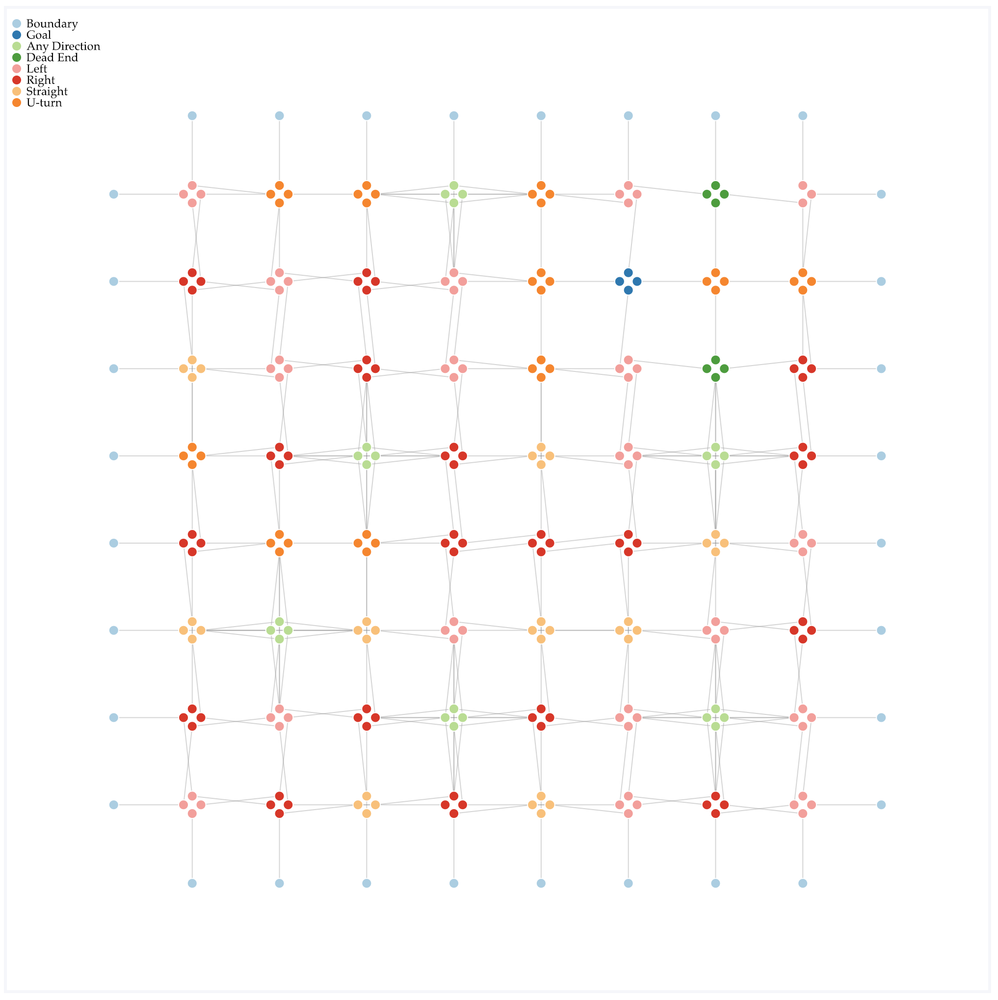
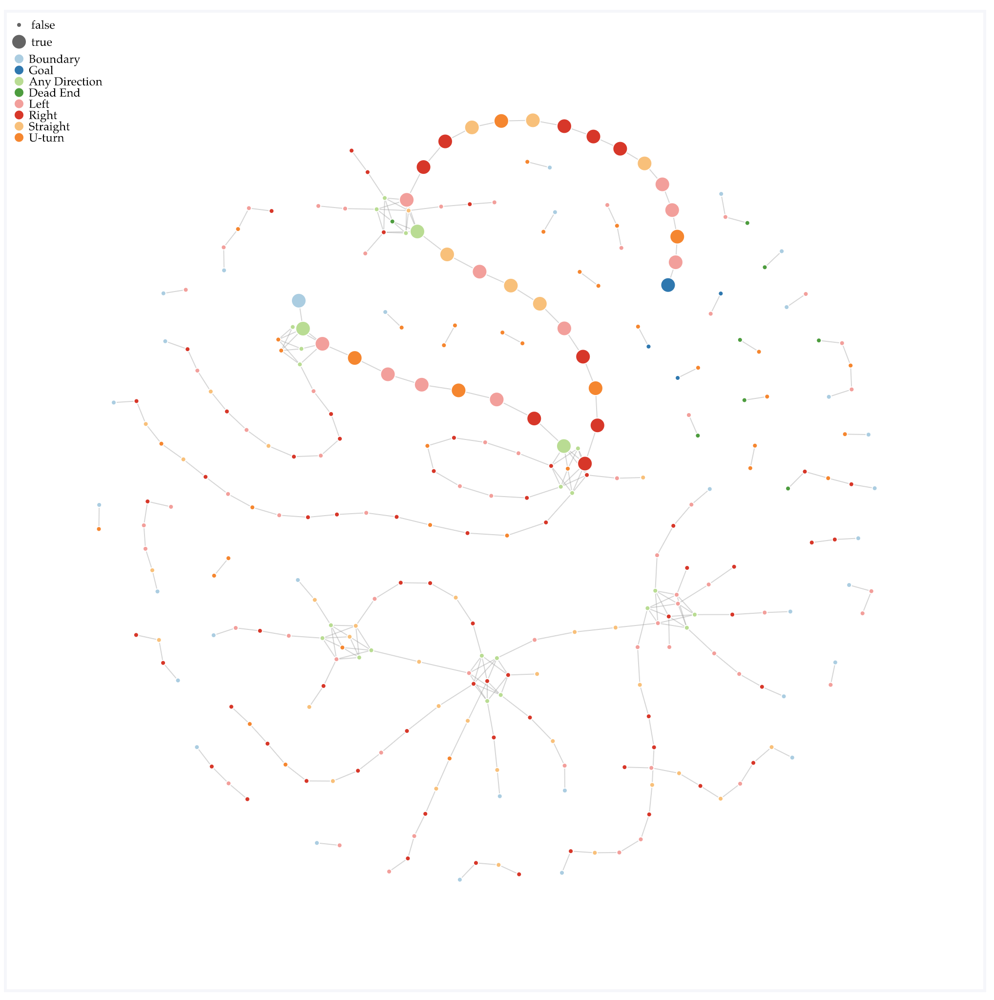

# 538 Puzzle - Can you escape a maze with no walls?

The original puzzle is posted [here](https://fivethirtyeight.com/features/can-you-escape-a-maze-without-walls/) by [Oliver Roeder](http://twitter.com/ollie) from the desk of Tom Hanrahan.

First of all, let's just solve the generic problem in order to solve this specific one. 

Second, let's reconsider the problem as an *escape* problem. You're at the smiley face, and you want to get out of the maze to the border. The behavior of S, U, and X squares is the same, but L squares send you right and R squares send you left. **We want to find an escape path from the goal to any boundary in the fewest number of hops**.

The key to both of the solutions below is that we'll split each grid square into what it really is: four nodes (top left bottom right), each of which has a different ability to connect to neighboring nodes. 

**Network Visualization Approach**
Why don't we just *build* this network and color the nodes by the type of node. If there is a connected path between a goal node and a boundary node, we'll just be able to see it. 

We'll use some code called [webweb](https://webwebpage.github.io) that makes network visualizations easy from Python, recently rewritten by my grad student, [Hunter Wapman](http://twitter.com/hneutr). 

The code plots the network as a grid, as described above, and it freeze the position of the nodes. **You can move the nodes around with your mouse if you like** and trace the escape path. I get a path length of 34. You can also uncheck the box that freezes node movement, and the system will "relax" allowing you to chart the number of hops from the Goal to the Boundary. I think it helps to set the node size to "onPath" to highlight the minimum path.

Screenshots are below, or you can [play with the viz yourself](http://danlarremore.com/538Maze.html).

Further nerdsniping: generate a square board of size $n^2$ with a single randomly placed goal, and the remaining squares drawn IID from a categorical distribution over $[L,R,S,U,?,X]$. How does the probability of path existence vary depending on the parameter vector of the categorical distribution? For instance, if the parameter is set to generate $X$ with probability one, then the goal is only reachable on the boundary, which occurs w.p. $4(n-1)/n^2$. Etc. 

